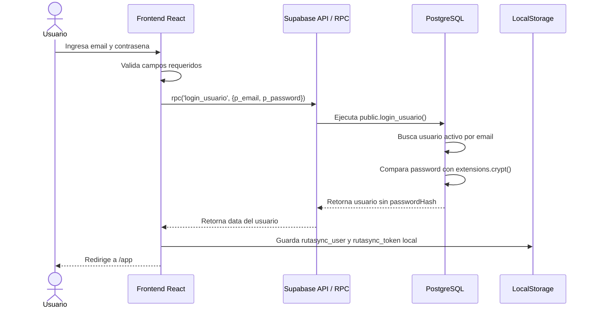
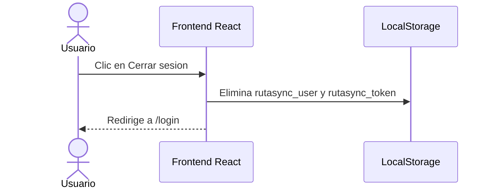

# Diagrama de Secuencia: Login con Supabase RPC

**Archivo de referencia:** `Diagrama_de_secuencia_para_autenticacion_JWT.png`

---

## Descripcion general

La arquitectura final ya no usa Nginx, API Gateway Node/Express, Auth Service separado, MySQL ni Redis para el login del frontend desplegado con Supabase.

El flujo actual es mas simple:

```text
Usuario -> Frontend React -> Supabase RPC login_usuario() -> PostgreSQL
```

La funcion `login_usuario()` valida el correo, el estado del usuario y la contrasena usando `extensions.crypt` sobre `usuarios.passwordHash`.

---

## Participantes reales

```text
Usuario
Frontend React/Vite
Supabase API (PostgREST + RPC)
PostgreSQL (tabla usuarios + funcion login_usuario)
LocalStorage (sesion del frontend actual)
```

No participan en la arquitectura final:

- API Gateway Nginx
- Auth Service Node.js/Express separado
- User Service MySQL separado
- Redis blacklist

---

## Secuencia principal



---

## Paso 1: Usuario ingresa credenciales

Campos requeridos:

```text
email
password
```

El frontend valida que ambos existan antes de llamar a Supabase.

---

## Paso 2: Frontend llama a Supabase RPC

```ts
const { data, error } = await supabase.rpc('login_usuario', {
  p_email: email.trim(),
  p_password: password
});
```

No se llama a `/api/auth/login` cuando el frontend esta usando Supabase directo.

---

## Paso 3: PostgreSQL valida credenciales

La funcion real:

```sql
public.login_usuario(p_email text, p_password text)
```

Condiciones:

- `lower(usuarios.email) = lower(p_email)`
- `usuarios.estado = true`
- `usuarios.passwordHash = extensions.crypt(p_password, usuarios.passwordHash)`

Retorna solo datos seguros:

```ts
{
  id: string;
  nombre: string;
  email: string;
  rol: 'ADMIN' | 'OPERARIO';
  sucursalId: string | null;
  estado: boolean;
}
```

Nunca retorna `passwordHash`.

---

## Paso 4: Frontend guarda sesion

El frontend actual guarda:

```text
rutasync_user
rutasync_token
```

El token actual funciona como marcador de sesion del frontend. No existe invalidacion en Redis.

---

## Logout actual



No existe blacklist de Redis en la BD final.

---

## Consideracion sobre JWT/Supabase Auth

En la arquitectura final actual, el login se resolvio con RPC `login_usuario()` y sesion local del frontend. Si mas adelante se migra a Supabase Auth real, el JWT y refresh token los gestionara Supabase Auth automaticamente, no un Auth Service propio.

---

## Resumen de correcciones frente al diseno anterior

| Antes | Ahora |
|---|---|
| Nginx / API Gateway | Frontend llama directo a Supabase |
| Auth Service Node/Express | RPC `login_usuario()` en PostgreSQL |
| User Service MySQL | Tabla `usuarios` en PostgreSQL |
| Backend genera JWT | Sesion local actual; futura migracion a Supabase Auth si se requiere JWT real |
| Redis blacklist | No implementado |
| MySQL | PostgreSQL Supabase |
