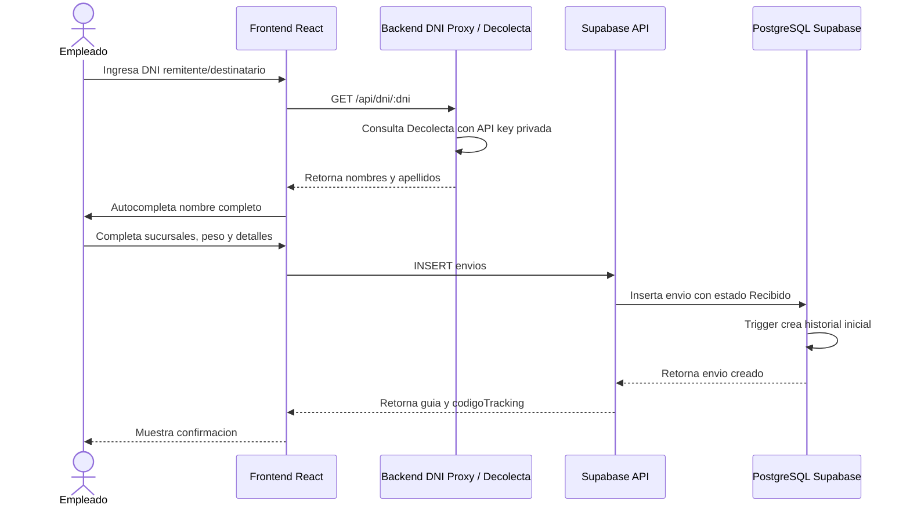

# Diagrama de Secuencia: Registro de Envio con DNI

**Archivo de referencia:** `Diagrama_de_secuencia_para_registro_de_envio.png`

---

## Descripcion general

Este flujo describe el registro de un envio en la arquitectura final con Supabase/PostgreSQL. La validacion de DNI se realiza antes o durante el registro mediante la API externa de Decolecta, usando un proxy backend cuando esta disponible para no exponer la API key.

La persistencia final ocurre en Supabase:

```text
Frontend React -> Supabase API / Backend proxy DNI -> PostgreSQL Supabase
```

---

## Participantes reales

```text
Empleado (ADMIN u OPERARIO)
Frontend React/Vite
Servicio DNI (backend proxy hacia Decolecta)
Supabase API (PostgREST + RPC)
PostgreSQL Supabase
```

No se modelan como microservicios independientes:

- Tracking Service
- Notification Service
- User Service MySQL

En la BD final, tracking e historial se representan con:

- `envios.codigoTracking`
- `historiales_estados`
- `notificaciones`

---

## Secuencia principal



---

## Datos capturados

```ts
interface CreateEnvioRequest {
  remitenteDni: string;
  remitenteNombre: string;
  destinatarioDni: string;
  destinatarioNombre: string;
  sucursalOrigenId: string;
  sucursalDestinoId: string;
  peso: number;
  dimensiones: string;
  tipoServicio: string;
  descripcion: string;
  valorDeclarado?: number;
}
```

Validaciones principales:

- DNI debe tener 8 digitos.
- Remitente y destinatario no deben tener el mismo DNI.
- Origen y destino deben apuntar a sucursales existentes.
- Peso debe ser mayor a 0.
- El estado inicial siempre es `Recibido`.

---

## Validacion de DNI

La API usada es Decolecta:

```text
GET https://api.decolecta.com/v1/reniec/dni?numero={dni}
Authorization: Bearer RENIEC_API_KEY
```

La API key debe vivir en el backend desplegado:

```env
RENIEC_API_URL=https://api.decolecta.com
RENIEC_API_KEY=...
```

El frontend no debe tener `VITE_DNI_API_KEY`, porque las variables `VITE_` quedan publicas en el bundle.

Respuesta esperada normalizada:

```ts
{
  nombreCompleto: string;
  nombres: string;
  apellidoPaterno: string;
  apellidoMaterno: string;
}
```

---

## Insercion del envio

La tabla final es `envios`.

Campos relevantes:

```text
guia
codigoTracking
remitenteDni
remitenteNombre
remitenteEmail
destinatarioDni
destinatarioNombre
destinatarioEmail
peso
dimensiones
tipoServicio
descripcion
estado = 'Recibido'
sucursalOrigenId
sucursalDestinoId
operarioAsignadoId
valorDeclarado
```

Correccion importante:

- No existe estado `REGISTRADO`.
- El estado inicial correcto es `Recibido`.
- No se guarda `origen` y `destino` como texto principal; se guardan `sucursalOrigenId` y `sucursalDestinoId`.

---

## Historial automatico

Al insertar un envio, la BD crea un historial inicial:

```text
estadoAnterior = null
estadoNuevo = 'Recibido'
razon = 'Envio registrado'
```

Cuando cambia `envios.estado`, la BD crea un nuevo registro en `historiales_estados`.

---

## Notificaciones

La notificacion no se modela como microservicio independiente en la BD final. Se registra en la tabla `notificaciones` con campos:

```text
tipo
destinatarioEmail
asunto
contenido
envioId
usuarioId
estado
mensajeError
intentos
proximoIntento
```

---

## Errores esperados

| Caso | Respuesta esperada |
|---|---|
| DNI con formato invalido | Mostrar error de DNI de 8 digitos |
| DNI no encontrado | Mostrar que el DNI no existe o no fue encontrado |
| API DNI no disponible | Permitir completar manualmente o mostrar warning, segun configuracion |
| Sucursal inexistente | Error de FK / sucursal invalida |
| Envio creado correctamente | Mostrar guia y codigo tracking |

---

## Resumen de correcciones frente al diseno anterior

| Antes | Ahora |
|---|---|
| API Gateway / Nginx | Frontend + Supabase / backend proxy DNI |
| MySQL | PostgreSQL Supabase |
| Tracking Service separado | `envios.codigoTracking` en Supabase |
| Notification Service como microservicio | tabla `notificaciones` |
| Estado inicial `REGISTRADO` | Estado inicial `Recibido` |
| User Service valida RENIEC | Backend DNI proxy consulta Decolecta |
